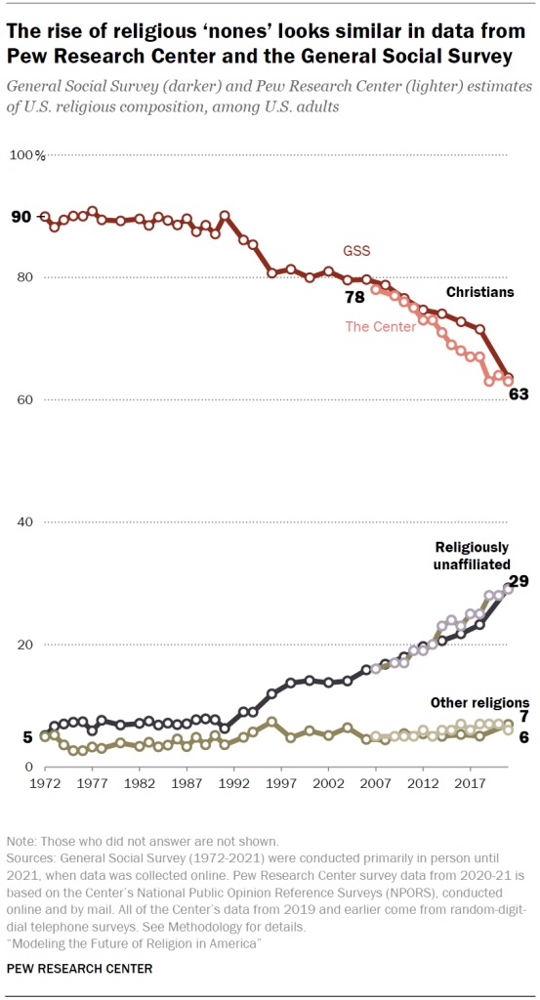
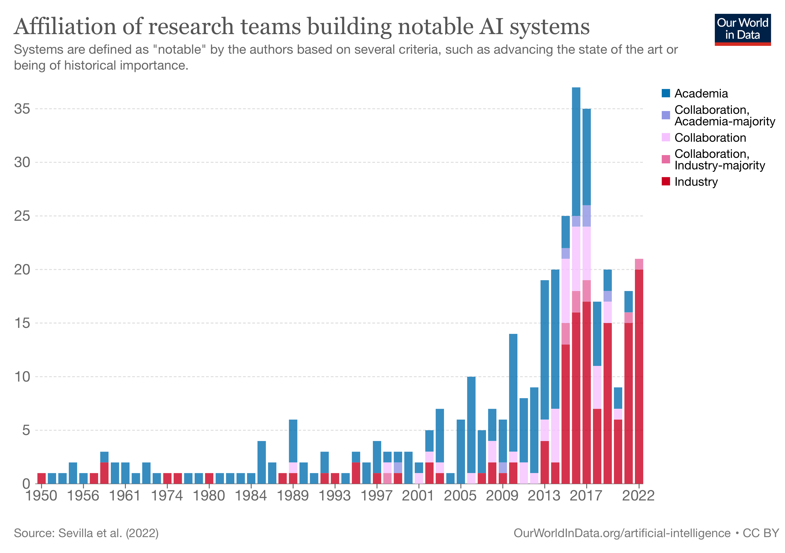
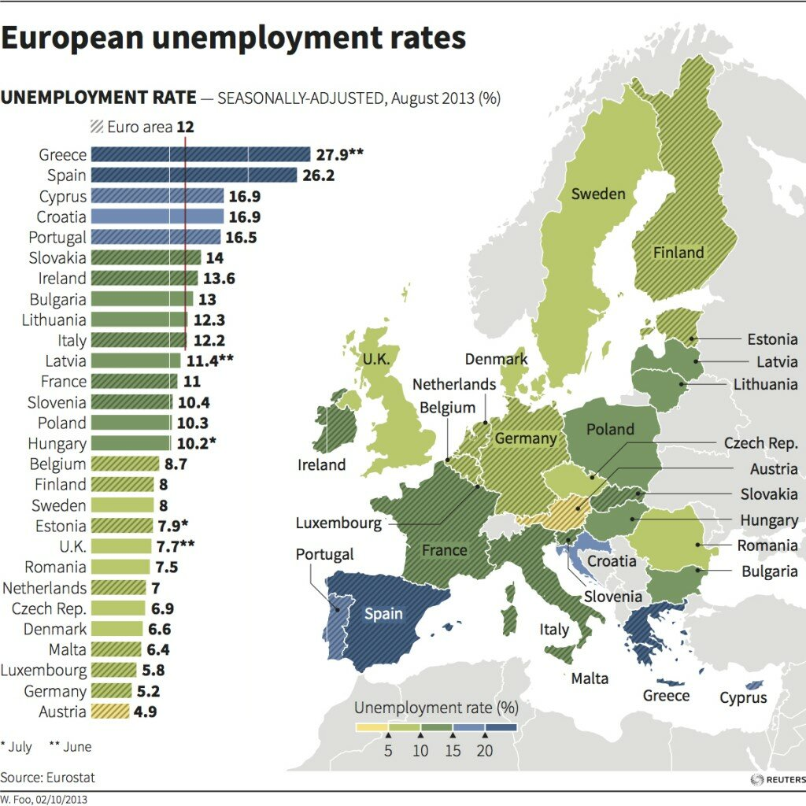
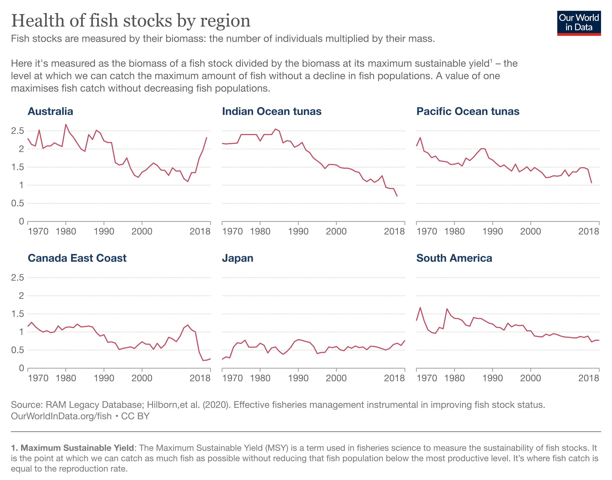
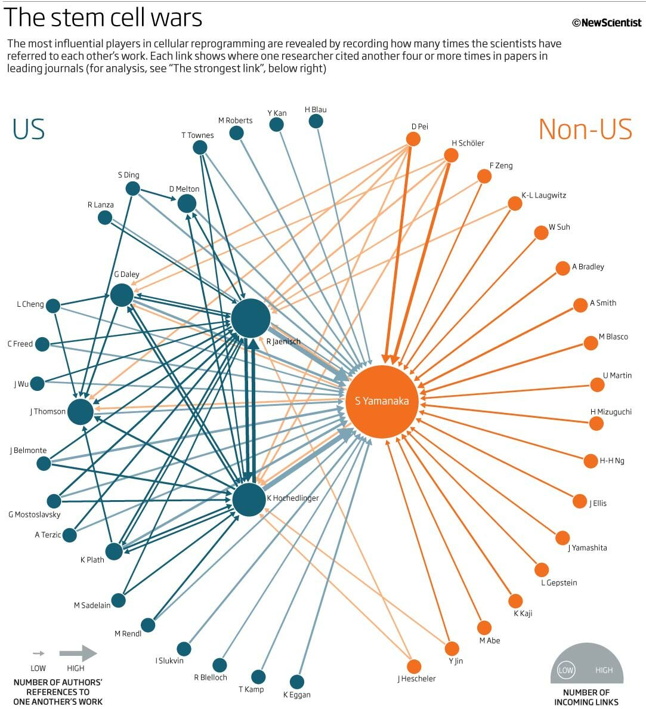

# Diagnostics & Quality Control
## Missing Value Handling & Principles of Visual Excellence

---
# Lecture Agenda & Topics

Exploratory data analysis requires vigilant data quality control and honest graphical communication.

Today we will cover:
* **Missingness Topologies**: Differentiating between explicit and implicit missing values.
* **Dynamic Fill-Down**: Propagating ledger entries with `tidyr::fill()`.
* **Placeholder Cleansing**: Converting legacy error codes (`-99`) to `NA` with `na_if()`.
* **Baseline Replacement**: Replacing missing defaults using `coalesce()`.
* **Imputation Strategies**: Calculating group medians and imputing missing fields.
* **Visual Diagnostics**: Identifying misleading charts, truncated axes, and 3D distortions.
* **The Principles of Visual Excellence**: Designing high-clarity, honest data graphics.

---
# Explicit vs. Implicit Missingness

In the tidyverse, missing data is categorized into two distinct forms:

| Missingness Type | Conceptual Definition | Practical Meaning |
| :--- | :--- | :--- |
| **Explicit Missingness** | *The Presence of an Absence* | The row exists in the dataset, but a specific cell is populated with an explicit `NA` marker. |
| **Implicit Missingness** | *The Absence of a Presence* | The entire observation row is entirely omitted from the dataset. |

```r
library(tidyverse)

stocks <- tibble(
  year  = c(2020, 2020, 2020, 2020, 2021, 2021, 2021),
  qtr   = c(   1,    2,    3,    4,    2,    3,    4),
  price = c(1.88, 0.59, 0.35,   NA, 0.92, 0.17, 2.66)
)
print(stocks)
```

* **Explicit Gap**: `2020 Q4` has a recorded row with `price = NA`.
* **Implicit Gap**: `2021 Q1` is entirely missing from the table.

---
# Exposing Implicit Missingness with `complete()`

To turn implicit missing combinations into explicit `NA` rows, use **`complete()`**:

```r
library(tidyverse)

stocks <- tibble(
  year  = c(2020, 2020, 2020, 2020, 2021, 2021, 2021),
  qtr   = c(   1,    2,    3,    4,    2,    3,    4),
  price = c(1.88, 0.59, 0.35,   NA, 0.92, 0.17, 2.66)
)

# Expand table to include all possible year and qtr combinations
stocks |>
  complete(year, qtr)
```

Now `2021 Q1` appears explicitly as a row with `price = NA`.

---
# Dynamic Fill-Down: `tidyr::fill()`

In human-entered ledger sheets, repetitive values are often left blank. We can fill these downward using **`fill()`**:

```r
library(tidyverse)

clinical_trials <- tribble(
  ~person,             ~treatment, ~response,
  "Derrick Whitmore",  1,          7,
  NA,                  2,          10,
  NA,                  3,          NA,
  "Katherine Burke",   1,          4,
  NA,                  2,          NA
)

# Propagate the last non-missing value downward
clinical_trials |>
  fill(person, response, .direction = "down")
```

---
# Cleaning Legacy Placeholders with `na_if()`

Legacy systems often encode missing measurements with placeholder codes like `-99` or `999`. If untreated, these distort arithmetic means and standard deviations:

```r
library(tidyverse)

raw_scores <- c(-99, 14, 18, -99, 15)

# Convert all -99 values to proper R NA markers
clean_scores <- na_if(raw_scores, -99)
print(clean_scores)

# Accurate mean calculation
mean(clean_scores, na.rm = TRUE)
```

---
# Substituting Fixed Baselines with `coalesce()`

When missing values represent known baseline defaults (such as zero sales on inactive days), use **`coalesce()`**:

```r
library(tidyverse)

daily_sales <- c(120, 150, NA, 180, NA)

# Replace all NA values with 0
filled_sales <- coalesce(daily_sales, 0)
print(filled_sales)
```

`coalesce()` evaluates vectors element-by-element and returns the first non-missing value.

---
# Auditing and Imputing Missing Values

Let's audit missing data on the Titanic passenger manifest:

```r
library(tidyverse)

# Load Titanic manifest
titanic = read.csv('https://raw.githubusercontent.com/jravi123/datasets/refs/heads/main/titanic.csv')

# Count missing cells per column
colSums(is.na(titanic))
```

### Imputation by Class-Specific Mean:
Instead of using the overall average age, a better strategy is to use the average age specific to the passenger class.

```r
library(tidyverse)

# Impute missing ages with class-specific mean
titanic |>
  group_by(pclass) |>
  mutate(
    class_mean = mean(age, na.rm = TRUE),
    age_imputed = coalesce(age, class_mean)
  ) |>
  ungroup()
```

---
# Some Rules of Visual Excellence

When presenting data, charts must be both **honest** (true to values) and **readable** (easy for human cognition):

| Rule | Principle | Practical Application |
| :---: | :--- | :--- |
| **1** | **Label Axes Clearly** | Always include descriptive titles and **measurement units** (%, USD, mm). |
| **2** | **Clarify Visual Encodings** | Explain color palettes, shapes, and point sizes explicitly. |
| **3** | **Select Appropriate Geometries** | Do not use discrete bar charts for continuous temporal trends. |
| **4** | **Maximize Data-to-Ink Ratio** | Eliminate clutter, redundant borders, and gratuitous backgrounds. |
| **5** | **Always Cite Data Sources** | Provide clear attribution and sample sizes ($n$). |
| **6** | **Preserve Bar Baselines at Zero**| Length encodes magnitude; truncated bars distort proportions. |
| **7** | **Limit Discrete Color Hues** | Restrict categorical palettes to $< 5$ colors to avoid cognitive overload. |

---
# Good Visualization Examples

Here are some examples of effective visualizations that follow the principles of visual excellence:

## Example 1: Nones

*Source: Our World in Data (https://ourworldindata.org)*


---
# Example 2: AI Systems

*Source: Our World in Data (https://ourworldindata.org/artificial-intelligence)*

---

## Example 3: Europe Unemployment

*Source: Our World in Data (https://ourworldindata.org/work-employment)*

---

## Example 4: Fish Stock

*Source: Our World in Data (https://ourworldindata.org/fish-and-overfishing)*

---

## Example 5: Page Rank (Stem Cell Wars)

*Source: Our World in Data (https://ourworldindata.org)*

---
# Bad Visualization 1: Truncated Y-Axes on Bar Charts

> [!CAUTION] The Fluctuation Exaggeration Trap
> Bar height directly encodes magnitude. Starting the $y$-axis above zero distorts visual ratios.

```r
library(tidyverse)
inflation_data <- tibble(Year = 2021:2024, Value = c(5.51, 6.65, 4.38, 4.56))

# BAD: Truncated axis makes a ~2% difference look 10x larger!
ggplot(inflation_data, aes(x = factor(Year), y = Value)) + 
  geom_col(fill = "steelblue") +
  coord_cartesian(ylim = c(4.4, 7.0)) # MISLEADING!

```

```r

# GOOD: Line chart captures temporal trajectory with an honest zero baseline
ggplot(inflation_data, aes(x = Year, y = Value)) + 
  geom_line(color = "darkblue", linewidth = 1.2) +
  geom_point(size = 3) +
  scale_y_continuous(limits = c(0, 8)) +
  labs(title = "Annual Inflation Rates (2021-2024)", y = "Inflation Rate (%)", x = "Year")
```

---
# Bad Visualization 2: High-Cardinality Pie Charts

> [!CAUTION] The Angle & Area Distortion Trap
> The human eye struggles to accurately evaluate angles and polar slice areas with $> 3$ categories.

```r
library(tidyverse)

# BAD: Pie chart with 7 slices is unreadable and distorts proportions
diamonds |> 
  count(color) |> 
  ggplot(aes(x = "", y = n, fill = color)) +
  geom_bar(stat = "identity", width = 1) +
  coord_polar("y") # MISLEADING!

```

```r

# GOOD: Sorted horizontal bar chart aligns all classes along a shared linear baseline
diamonds |> 
  count(color) |> 
  ggplot(aes(x = n, y = fct_reorder(color, n), fill = color)) +
  geom_col(show.legend = FALSE) +
  labs(title = "Diamond Inventory by Color Grade", x = "Total Count", y = "Color Grade")
```

---
# Bad Visualization 3: Continuous Variable Legend Overload

> [!CAUTION] The Factor Casting Trap
> Converting a continuous numerical column with many unique decimals into a `factor` spawns a massive, unreadable legend.

```r
library(tidyverse)

# BAD: Casting numeric 'z' to factor creates 50+ individual color legend boxes
diamonds |> 
  filter(carat > 2) |> 
  ggplot(aes(x = carat, y = price, color = factor(z))) + 
  geom_point() # MISLEADING / UNREADABLE!

```


```r

# GOOD: Retain numeric scale and use a continuous, perceptually uniform color ramp
diamonds |> 
  filter(carat > 2) |> 
  ggplot(aes(x = carat, y = price, color = z)) + 
  geom_point(alpha = 0.6) + 
  scale_color_viridis_c() +
  labs(title = "Diamond Prices by Depth (z)", x = "Carat", y = "Price ($)", color = "Depth (z)")
```

---
# Bad Visualization 4: 3D Distortion & Occlusion

> [!CAUTION] The Perspective & Occlusion Trap
> 3D plots create perspective parallax and occlusion (foreground surfaces hiding background observations).

Both plots below visualize the exact same mathematical "bowl" function: **$z = x^2 + y^2$**.

* **The 3D plot (Bad):** The front edge physically hides the data behind it (occlusion), and perspective distortion makes it impossible to accurately read or compare values.
* **The 2D contour (Good):** Looks straight down like a topographical map, using color for height (Z). Nothing is hidden, and the grid scales are perfectly accurate.

```r
x <- y <- seq(-3, 3, length.out = 50)
z <- outer(x, y, function(x, y) x^2 + y^2)

# BAD: 3D surface hides back coordinates and distorts metric distances
persp(x, y, z, theta = 30, phi = 20, col = "lightblue", shade = 0.5) # MISLEADING!

```


```r

# GOOD: 2D Filled Contour plot reveals full landscape without perspective distortion
filled.contour(
  x, y, z, 
  color.palette = terrain.colors,
  xlab = "Dimension X", ylab = "Dimension Y", 
  key.title = title("Z Value")
)
```

---
# Bad Visualization 5: Floating Baselines on Stacked Bars

> [!CAUTION] The Shifting Baseline Trap
> In stacked bar charts, middle and upper segments have floating, variable baselines, making category comparison impossible.

```r
library(tidyverse)

user_data <- tibble(
  Year = rep(2021:2023, each = 3),
  Platform = rep(c("Google", "Facebook", "Twitter"), 3),
  Users = c(250, 200, 150, 260, 240, 170, 310, 260, 200)
)


# BAD: Stacked bars make comparing Facebook & Twitter trends over time difficult
ggplot(user_data, aes(x = factor(Year), y = Users, fill = Platform)) +
  geom_bar(stat = "identity") # HARD TO COMPARE!

```


```r

# GOOD: Multi-line chart places all platforms on a shared vertical zero baseline
ggplot(user_data, aes(x = Year, y = Users, color = Platform)) +
  geom_line(linewidth = 1.2) +
  geom_point(size = 3) +
  scale_x_continuous(breaks = 2021:2023) +
  labs(title = "Platform User Growth (2021-2023)", y = "Users (Millions)", x = "Year")
```

---
# Bad Visualization 6: Dodged Bar Clutter in Time Series

> [!CAUTION] The Temporal Clutter Trap
> Grouping ("dodging") multiple discrete bars across several calendar years breaks visual continuity.

```r
library(tidyverse)

# BAD: Cluttered bar clusters obscure the slope and trajectory of user trends
ggplot(user_data, aes(x = factor(Year), y = Users, fill = Platform)) +
  geom_bar(stat = "identity", position = "dodge") # CLUTTERED!

```

```r

# GOOD: Clean line paths enable instant visual trajectory and slope tracking
ggplot(user_data, aes(x = Year, y = Users, color = Platform)) +
  geom_line(linewidth = 1.2) +
  geom_point(size = 2.5) +
  scale_x_continuous(breaks = 2021:2023) +
  theme_minimal() +
  labs(title = "Annual Platform User Volume Trends", y = "Users (Millions)", x = "Year")
```

---
# Bad Visualization 7: Dual Y-Axes

> [!CAUTION] The Dual Axis Trap
> Mapping two different scales to the left and right y-axes creates arbitrary crossing points and implies false correlations.

```r
library(tidyverse)

# BAD: Dual Y-axes manipulate the crossover point by scaling axes differently
ggplot(economics, aes(x = date)) +
  geom_line(aes(y = psavert), color = "red") + 
  geom_line(aes(y = uempmed * 10), color = "blue") + 
  scale_y_continuous(sec.axis = sec_axis(~./10, name = "Unemployment")) # CONFUSING!

```


```r

# GOOD: Faceting separates the scales but aligns the temporal x-axis
economics |>
  select(date, psavert, uempmed) |>
  pivot_longer(-date) |>
  ggplot(aes(x = date, y = value, color = name)) +
  geom_line(linewidth = 1) +
  facet_wrap(~name, scales = "free_y", ncol = 1) +
  theme_minimal() +
  labs(title = "Savings Rate vs. Unemployment Duration", x = "Year")
```

---
# Bad Visualization 8: The Spaghetti Chart

> [!CAUTION] The Spaghetti Trap
> Plotting dozens of unhighlighted categorical lines on the same plot creates a messy "spaghetti" blob that obscures individual trends.

```r
library(tidyverse)

# Generate sample multi-trend data
set.seed(42)
spaghetti_data <- expand_grid(time = 1:20, group = letters[1:15]) |>
  mutate(value = cumsum(rnorm(n())), .by = group)

# BAD: All lines colored indiscriminately creates visual noise
ggplot(spaghetti_data, aes(x = time, y = value, color = group)) +
  geom_line(linewidth = 1) # MESSY & UNREADABLE!

```


```r

# GOOD: Highlight one focal trend in color while keeping others in gray context
ggplot(spaghetti_data, aes(x = time, y = value, group = group)) +
  geom_line(color = "gray80", linewidth = 0.8) +
  geom_line(data = filter(spaghetti_data, group == "c"), color = "firebrick", linewidth = 1.5) +
  labs(title = "Highlighting Trend 'C' Against the Cohort", x = "Time", y = "Value")
```


---
# You will find bad visualizations a lot!

Sometimes the easiest way to learn what to do is to study what not to do...

[Reference: Bad Visualisations Tumblr](https://www.tumblr.com/badvisualisations)

---

# Module Summary & Key Takeaways

1. **Explicit vs. Implicit**: Explicit missingness appears as `NA`; implicit missingness is an omitted row.
2. **`complete()` & `fill()`**: `complete()` exposes implicit rows; `fill()` carries valid values down ledger columns.
3. **`na_if()` & `coalesce()`**: `na_if()` turns sentinel codes into `NA`; `coalesce()` replaces `NA` with constants.
4. Review your final diagrams to confirm its correctness.
